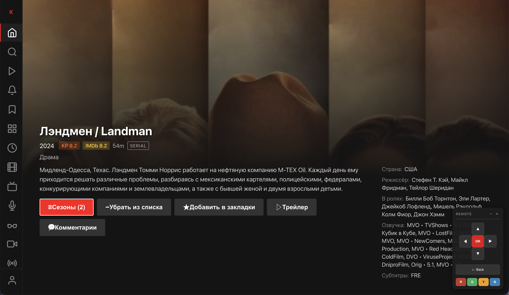
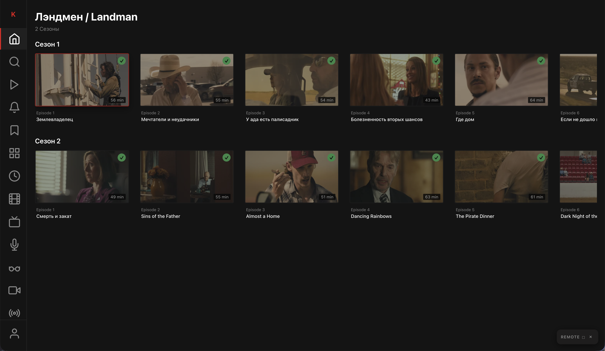

# KPuppy (darkpal fork)


Fork of [twttr/KPuppy](https://github.com/twttr/KPuppy) — a lightweight webOS LG TV app for KinoPub online cinema.

Upstream: https://github.com/twttr/KPuppy  
This fork: https://github.com/darkpal/KPuppy

## Install (Homebrew Channel)

Add this repository URL in Homebrew Channel → Settings → Add repository:

```text
https://raw.githubusercontent.com/darkpal/KPuppy/develop/homebrew/apps.json
```

Packages are published via [GitHub Releases](https://github.com/darkpal/KPuppy/releases/latest).

## Changes from upstream

Compared to [twttr/KPuppy](https://github.com/twttr/KPuppy):

- **Resume playback** — restore position from `watching.time`, save on pause/back, pass position to the native player
- **Magic Remote** — click-to-seek on the progress bar; cursor clicks across the UI (menus, озвучка / subtitles panels)
- **Player controls** — Up/Down to show/hide controls; improved hover preview and play/pause
- **Озвучка** — classic HLS (`master-v1aN`) track switching for the built-in player; prefer classic HLS when using builtin
- **Subtitles** — selection via remote and Magic Remote click
- **Home feed** — «Популярные» rows use Kinopub `/v1/items/hot` (same shortcut as the Apple client)
- **Defaults** — built-in player, Auto quality, 4K/HEVC/HDR/SSL, Netherlands + HLS, Continue watching on; UI language follows the TV locale (ru/en/de)
- **webOS packaging** — releases as IPK + Homebrew manifest for this fork

## Features (from upstream)

- Netflix-style dark UI optimized for TV remote navigation
- Device code authentication
- Browse movies, series, concerts, documentaries, TV shows
- Continue watching, search
- Multi-language support (English, Russian, German)
- Quality selection (4K, 1080p, 720p, 480p)

## Screenshots

 
 

## Requirements

- Node.js 18+
- webOS TV SDK (ares-cli)

## Development

```bash
npm install
npm run dev
npm test
npm run build
```

## Deployment

```bash
npm run package
npm run deploy
ares-launch com.kpuppy.app
```

## Tech Stack

- Preact, TypeScript, Vite, Vitest

## License

MIT — see [LICENSE](LICENSE).

This project is based on [twttr/KPuppy](https://github.com/twttr/KPuppy) (MIT). Modifications in this fork © 2026 darkpal.
