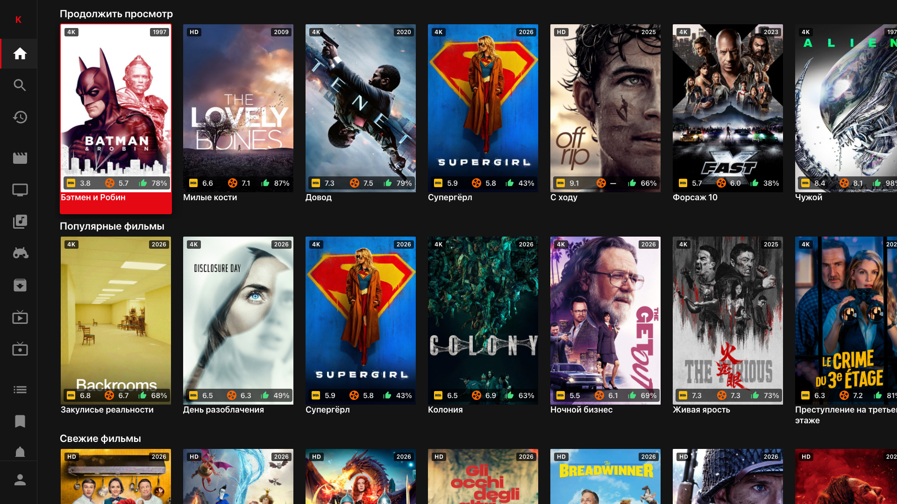
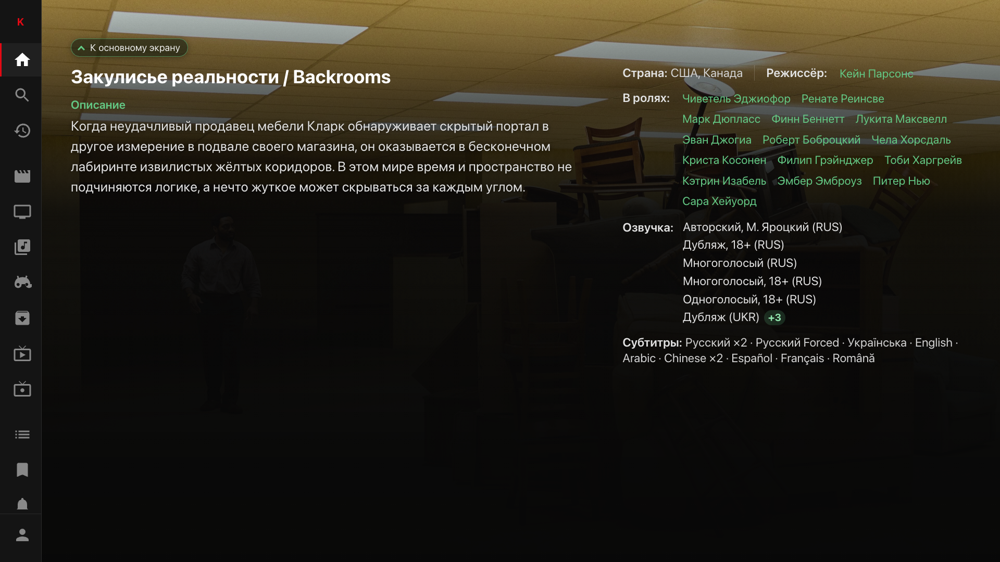
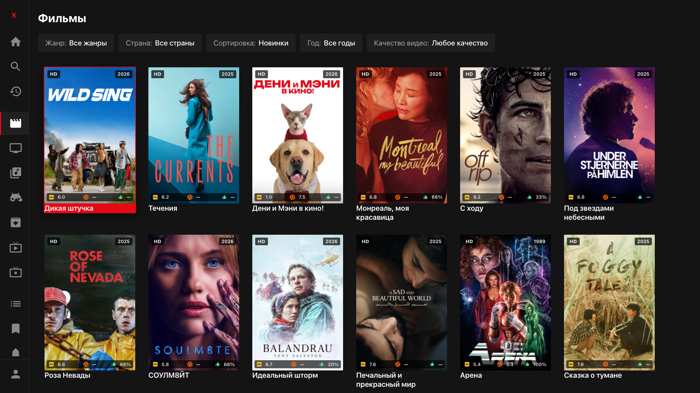

# KPuppy


KinoPub client for LG webOS TV — movies, series, Live TV, collections, and a remote-friendly player.

Based on [twttr/KPuppy](https://github.com/twttr/KPuppy). This fork: https://github.com/darkpal/KPuppy

## Install (Homebrew Channel)

Add this repository URL in Homebrew Channel → Settings → Add repository:

```text
https://raw.githubusercontent.com/darkpal/KPuppy/main/homebrew/apps.json
```

Packages are published via [GitHub Releases](https://github.com/darkpal/KPuppy/releases/latest).

## Features

- Catalogs: movies, series, concerts, documentaries, TV shows, 3D
- Live TV (HLS) and collections («Подборки»)
- Continue watching, bookmarks, «Я смотрю», history, search (webOS keyboard / Magic Remote voice)
- Title card with plot, cast, similar titles (grid), playback quality
- Built-in and native webOS players; audio tracks and subtitles; resume from last position
- Magic Remote pointer/click across the UI; languages: Russian, English, German

## Screenshots

 
 

## Requirements

- Node.js 18+
- webOS TV SDK (ares-cli)

## Development

```bash
npm install
npm run dev
npm test
npm run build
```

Capture README screenshots (device-code login once; tokens in gitignored `.kpuppy-tokens.json`):

```bash
npm run capture:screenshots
```

## Deployment

```bash
npm run package
npm run deploy
ares-launch com.kpuppy.app
```

## Tech Stack

- Preact, TypeScript, Vite, Vitest

## License

MIT — see [LICENSE](LICENSE).

This project is based on [twttr/KPuppy](https://github.com/twttr/KPuppy) (MIT). Modifications in this fork © 2026 darkpal.
